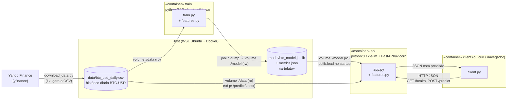
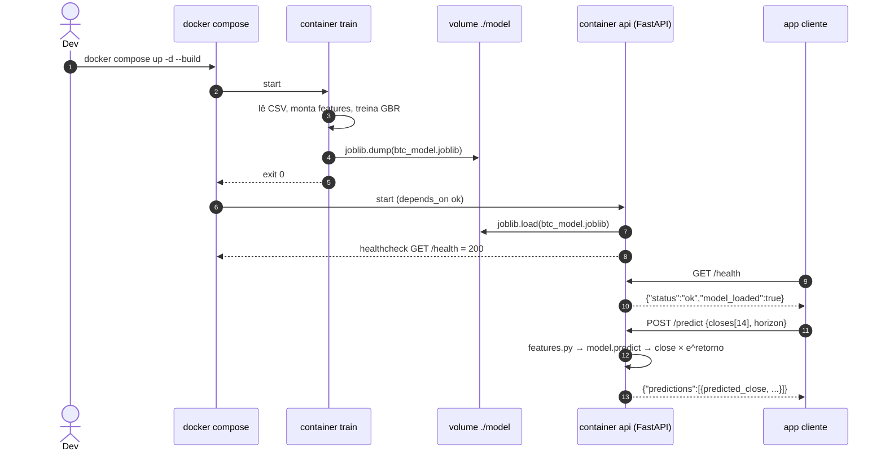

# Dev Log

Nome: Rafael Santana Rodrigues

> Diário de bordo da atividade ponderada do M7: treinar um modelo que chuta o preço do Bitcoin de amanhã, empacotar isso em container e servir as previsões por uma API em Python

---

## TL;DR — como rodar

Precisa só de Docker + Docker Compose. No meu caso foi pelo WSL (Ubuntu-26.04).

```bash
git clone https://github.com/RafaelSR44/Atividade-Ponderada-M7-2026-EC.git
cd Atividade-Ponderada-M7-2026-EC

docker compose up -d --build          # treina (container train) e depois sobe a API (container api)
curl http://localhost:8000/health     # {"status":"ok","model_loaded":true}
curl "http://localhost:8000/predict/latest?horizon=3"
docker compose --profile client run --rm client   # app cliente pedindo previsão pra API
docker compose down
```

Swagger interativo: http://localhost:8000/docs (abrir `http://localhost:8000/` já redireciona pra lá).

---

## Arquitetura (UML)

### Componentes e como o modelo chega na API



**Como o modelo treinado chega ao container de inferência:** os dois containers montam a mesma pasta `./model` do host. O `train` escreve o `btc_model.joblib` ali, e o `api` monta a pasta em modo *read-only* e carrega o arquivo quando sobe. O `docker-compose.yml` tem `depends_on: train: condition: service_completed_successfully`, então a API só sobe **depois** que o treino terminou com exit 0. O artefato também está commitado no repo, então dá pra subir só a API se quiser (`docker compose up -d --no-deps api`).

### Sequência



---

## Estrutura do repo

```
data/
  download_data.py      # baixa o histórico do Yahoo Finance e gera o CSV
  btc_usd_daily.csv     # 4295 dias, 2015-01-01 -> 2026-10-04 (Date,Open,High,Low,Close,Volume)
common/features.py      # engenharia de features (copiada pros DOIS containers)
training/               # Dockerfile + requirements + train.py
model/                  # artefato gerado: btc_model.joblib + metrics.json
inference/              # Dockerfile + requirements + app.py (FastAPI)
client/                 # Dockerfile + client.py (app cliente)
docker-compose.yml      # orquestra train -> api -> client
docs/evidencias/        # saídas reais dos comandos (treino, curl, client, reprodução)
```

---

## Diário de bordo

### #1 — Entendendo o desafio e escolhendo a stack

Li o enunciado e a parada é basicamente: **um container treina, gera um arquivo de modelo, outro container carrega esse arquivo e responde previsões por HTTP**. O professor deixou claro que não precisa prever bem, precisa *integrar* bem.

Decisões:
- **Linguagem:** Python em tudo (o backend é obrigatório em Python, e no treino também faz sentido).
- **Modelo:** scikit-learn. Pensei em LSTM/Prophet, mas é instalar PyTorch (imagem de GBs) pra ganhar quase nada num desafio de 100 min. Um `GradientBoostingRegressor` treina em segundos e o artefato fica com ~500 KB.
- **Formato do artefato:** `joblib` (padrão do sklearn). Salvo um dicionário com o modelo **e** os metadados (janela, nome das features, data do treino, versão do sklearn, métricas), assim a API consegue mostrar tudo isso em `/model/info`.
- **Backend:** FastAPI + uvicorn. Já valida o JSON de entrada com pydantic e gera o Swagger em `/docs` de graça.
- **Orquestração:** docker compose com 3 serviços (`train`, `api`, `client`).

Desenhei o UML lá de cima antes de codar, pra saber o que ia em cada container.

### #2 — Pegando os dados

Escolhi **BTC-USD diário do Yahoo Finance** via biblioteca `yfinance`: é gratuito, não precisa de chave de API e vai de 2015 até ontem. Fiz o `data/download_data.py`, que baixa, achata as colunas (o yfinance devolve um MultiIndex chato tipo `('Close','BTC-USD')`), arredonda pra 2 casas e salva em CSV.

Pra não instalar nada no Windows, rodei o script num container descartável:

```bash
docker run --rm -v "$PWD/data:/data" -w /data python:3.12-slim \
  bash -c "pip install -q yfinance; python download_data.py"
```

Resultado: **4295 linhas, de 2015-01-01 até 2026-10-04**, último fechamento US$ 86.480,30. O CSV ficou commitado em `data/btc_usd_daily.csv` (≈235 KB), então ninguém precisa baixar de novo. Log completo: [docs/evidencias/00_download_dados.txt](docs/evidencias/00_download_dados.txt).

### #3 — Perrengue: `permission denied` no Docker 😤

Primeira tentativa de rodar o container e...

```
permission denied while trying to connect to the docker API at unix:///var/run/docker.sock
```

Fui investigar:

```bash
$ id
uid=1000(roque) gid=1000(roque) groups=1000(roque),4(adm),24(cdrom),27(sudo),...   # cadê o docker?
$ ls -l /var/run/docker.sock
srw-rw---- 1 root docker 0 Oct  5 14:28 /var/run/docker.sock
```

O socket do Docker só aceita root ou quem é do grupo `docker`, e meu usuário não estava no grupo. Resolvi com:

```bash
sudo usermod -aG docker $USER
# e depois fechar/reabrir o terminal do Ubuntu (ou `wsl --terminate Ubuntu-26.04` no PowerShell)
docker ps   # agora funciona sem sudo
```

Outro detalhe: no meu Windows a distro **padrão** do WSL é o Kali, não o Ubuntu, então `wsl docker ...` dava `docker: command not found`. Tem que abrir o Ubuntu direto ou usar `wsl -d Ubuntu-26.04`. Também tentei disparar os comandos pelo PowerShell e as aspas aninhadas (PowerShell → wsl → bash → docker → bash -c) viraram um inferno. **Dica pro eu do futuro: roda tudo de dentro do terminal do Ubuntu, na pasta do repo** (`cd /mnt/c/Users/roque/OneDrive/.../Atividade-Ponderada-M7-2026-EC`).

### #4 — Modelagem: prever o preço ou o retorno?

Primeira ideia seria jogar os preços dos últimos dias e prever o preço de amanhã. Só que **árvore de decisão não extrapola**: se treina com BTC até US$ 70k e o preço atual é US$ 86k, ela nunca vai prever mais do que o maior valor visto nos dados de treino. Por isso mudei pra prever o **retorno log do dia seguinte**:

```
alvo = log(close[t+1] / close[t])
preço previsto = close[t] × e^(retorno previsto)
```

Retorno é estacionário (fica oscilando perto de 0 independente se o BTC tá a 300 ou a 90 mil), então o modelo funciona em qualquer faixa de preço.

**Features** (em `common/features.py`, a partir de uma janela de 14 fechamentos):
- `ret_lag_1..7`: retornos log dos últimos 7 dias
- `close_over_ma7`, `close_over_ma14`: o quanto o preço tá acima/abaixo da média de 7 e 14 dias
- `vol_7d`: volatilidade (desvio-padrão dos retornos de 7 dias)

O pulo do gato foi deixar isso **num arquivo só** (`common/features.py`) que é copiado pros dois containers. Se treino e API calculassem features de jeitos diferentes, o modelo receberia lixo em produção e ninguém ia perceber (o famoso *training/serving skew*). Por isso o build context do compose é a raiz do repo (`context: .`), pra os Dockerfiles conseguirem dar `COPY common/features.py`.

**Avaliação:** split **cronológico** (80% mais antigo treina, 20% mais recente testa). Nada de `train_test_split` aleatório, que vaza o futuro pro treino em série temporal. Comparei com o baseline ingênuo "amanhã = hoje".

### #5 — Treinando no container

```bash
docker compose build train
docker compose run --rm train
```

```
[dados] 4295 dias | 2015-01-01 -> 2026-10-04
[dados] 4281 amostras | treino=3424 teste=857 (split cronológico)
[avaliação] {
  "test_period": ["2024-05-31", "2026-10-04"],
  "model_mae_usd": 1394.02,   "model_mape_pct": 1.678,
  "naive_mae_usd": 1380.9,    "naive_mape_pct": 1.663,
  "direction_accuracy_pct": 48.19
}
[artefato] salvo em /app/model/btc_model.joblib (523 KB)
```

Exit code 0, e o `model/btc_model.joblib` apareceu no host graças ao volume. Log completo: [docs/evidencias/01_treino.txt](docs/evidencias/01_treino.txt).

**Sendo honesto sobre o resultado:** o modelo erra em média US$ 1.394 (1,68%) no dia seguinte, e o baseline "amanhã = hoje" erra US$ 1.381 (1,66%). Ou seja, **empatou com o chute ingênuo**, e acertou a direção (sobe/desce) em 48% das vezes, que é cara ou coroa. Isso é esperado: preço de cripto no curto prazo é praticamente um passeio aleatório, e se desse pra prever com 10 features de preço passado todo mundo estaria rico. Como o objetivo do desafio é a integração, segui em frente, mas deixei as métricas salvas no artefato e expostas na API pra ninguém achar que o modelo é bom.

Depois de avaliar, **re-treino com 100% dos dados** pra gerar o modelo final (faz sentido usar os dados mais recentes pra prever amanhã). As métricas salvas são as do teste.

### #6 — O artefato e o "contrato" entre os containers

O que vai dentro do `btc_model.joblib`:

```python
{
  "model": GradientBoostingRegressor(...),
  "window": 14,
  "feature_names": [...],
  "target": "log(close[t+1] / close[t])",
  "trained_at": "2026-10-05T17:46:43+00:00",
  "data_last_date": "2026-10-04",
  "sklearn_version": "1.5.2",
  "metrics": {...}
}
```

Cuidado que tomei: **pickle/joblib de sklearn só é garantido na mesma versão**. Se o treino usar sklearn 1.5 e a API 1.6, pode dar warning ou até erro ao carregar. Então os dois `requirements.txt` pinam exatamente as mesmas versões de `numpy`, `pandas`, `scikit-learn` e `joblib`, e salvei a `sklearn_version` no artefato pra facilitar o debug.

### #7 — Backend de inferência (FastAPI)

`inference/app.py` carrega o modelo uma vez no startup (`lifespan`) e expõe:

| Método | Rota | O que faz |
|---|---|---|
| GET | `/health` | diz se o serviço tá de pé e se o modelo carregou |
| GET | `/model/info` | metadados + métricas do artefato |
| POST | `/predict` | recebe `{"closes": [≥14 preços], "horizon": 1..7}` e devolve a previsão |
| GET | `/predict/latest?horizon=N` | mesma coisa, mas pega os últimos 14 dias do CSV (atalho pra demo) |
| GET | `/` | redireciona pro Swagger `/docs` |

Para `horizon > 1` a previsão é **recursiva**: prevê D+1, coloca na janela como se fosse real, prevê D+2, e assim por diante. Limitei a 7 dias porque o erro vai acumulando.

Coloquei também um `HEALTHCHECK` no Dockerfile. Detalhe: a imagem `python:3.12-slim` **não tem curl**, então o healthcheck usa o próprio Python (`urllib.request.urlopen('http://localhost:8000/health')`). Com isso o `docker compose ps` mostra `(healthy)` e o cliente pode usar `depends_on: condition: service_healthy`.

```bash
docker compose up -d --build api
docker compose ps -a
```
```
NAME                                     STATUS                      PORTS
atividade-ponderada-m7-2026-ec-api-1     Up 39 seconds (healthy)     0.0.0.0:8000->8000/tcp
atividade-ponderada-m7-2026-ec-train-1   Exited (0) 41 seconds ago
```

Repara que o `train` rodou e saiu com 0 antes da API subir, que é o `depends_on` funcionando. Log da API:

```
api-1  | [api] modelo carregado de /app/model/btc_model.joblib (treinado em 2026-10-05T17:41:27+00:00)
api-1  | INFO:     Uvicorn running on http://0.0.0.0:8000
```

### #8 — Testando com curl ✅

```bash
$ curl -s http://localhost:8000/health
{"status":"ok","model_loaded":true}

$ curl -s "http://localhost:8000/predict/latest?horizon=3"
{"last_close":86480.3,"last_date":"2026-10-04","horizon":3,"predictions":[
  {"predicted_log_return":0.001921,"predicted_close":86646.59,"date":"2026-10-05"},
  {"predicted_log_return":0.002056,"predicted_close":86824.92,"date":"2026-10-06"},
  {"predicted_log_return":0.001312,"predicted_close":86938.86,"date":"2026-10-07"}]}

$ curl -s -X POST http://localhost:8000/predict -H "Content-Type: application/json" \
  -d '{"closes": [86602.91,86172.28,84383.01,84379.06,84034.92,84406.45,84458.09,83502.61,83622.43,83553.85,84853.1,84497.21,84763.58,86480.3], "horizon": 1}'
{"last_close":86480.3,"last_date":null,"horizon":1,"predictions":[{"predicted_log_return":0.001921,"predicted_close":86646.59}]}
```

**Previsão: BTC fecha 05/10/2026 em ~US$ 86.646,59** (+0,19%). O POST com os mesmos 14 preços dá exatamente o mesmo resultado que o `/predict/latest`, o que confirma que os dois caminhos usam a mesma lógica.

Também testei se a API reclama direito quando a entrada é errada:

| Teste | Resposta |
|---|---|
| só 3 preços (precisa de 14) | `422` — "List should have at least 14 items" |
| preço negativo | `400` — "fechamentos precisam ser positivos" |
| `horizon=30` | `422` — "Input should be less than or equal to 7" |

E do **Windows** (fora do WSL) `curl http://localhost:8000/health` também responde, porque o WSL repassa a porta. Tudo em [docs/evidencias/02_api_curl.txt](docs/evidencias/02_api_curl.txt).

### #9 — A aplicação cliente

`client/client.py` simula a "aplicação": lê os últimos 14 fechamentos do CSV, checa `/health`, manda um `POST /predict` e imprime bonitinho. Roda como um terceiro container dentro da rede do compose, falando com a API pelo nome do serviço (`http://api:8000`):

```bash
$ docker compose --profile client run --rm client
[client] GET /health -> {'status': 'ok', 'model_loaded': True}
[client] enviando 14 fechamentos (2026-09-21 -> 2026-10-04), horizon=3
[client] POST /predict -> HTTP 200
[client] último fechamento real: US$ 86,480.30 (2026-10-04)
[client]   D+1: US$ 86,646.59  (+0.19% vs último)
[client]   D+2: US$ 86,824.92  (+0.40% vs último)
[client]   D+3: US$ 86,938.86  (+0.53% vs último)
```

E no log da API dá pra ver a request chegando de **outro IP** (`172.20.0.3`, o container do client), não do host:

```
api-1  | INFO:     172.20.0.3:55378 - "POST /predict HTTP/1.1" 200 OK
```

Usei `profiles: ["client"]` pra ele não subir junto no `docker compose up` (ele roda uma vez e sai). Evidência: [docs/evidencias/03_client.txt](docs/evidencias/03_client.txt).

### #10 — Ajuste: `GET /` dava 404

Olhando os logs da API apareceu `"GET / HTTP/1.1" 404 Not Found` (abri `localhost:8000` no navegador e não tinha nada). Coloquei uma rota `/` que redireciona (`307`) pro `/docs`, assim quem abrir no navegador já cai no Swagger e consegue testar o `/predict` clicando.

### #11 — Teste final: reproduzir do zero

Pra garantir que outra pessoa consegue reproduzir, derrubei tudo, **apaguei o artefato** e subi de novo:

```bash
docker compose down
rm -rf model/
docker compose up -d --build
```

O `train` recriou o `model/btc_model.joblib`, saiu com 0, a API subiu `healthy`, carregou o modelo novo e devolveu **exatamente a mesma previsão** (US$ 86.646,59), já que fixei `random_state=42` e o resultado é determinístico. Evidência: [docs/evidencias/04_reproducao_do_zero.txt](docs/evidencias/04_reproducao_do_zero.txt).

### #12 — O que eu faria com mais tempo

- Testar features que não sejam só de preço (volume, dominância, funding rate, sentimento) pra ver se dá pra bater o baseline.
- Validação *walk-forward* (vários cortes no tempo) em vez de um único split 80/20.
- Prever intervalo (quantis) em vez de um número só, que é mais honesto pra algo tão volátil.
- Guardar o artefato num registry (MLflow, S3 etc.) em vez de volume local, pra treino e inferência poderem rodar em máquinas diferentes.
- Testes automatizados (pytest + `TestClient` do FastAPI).

---

## Como reproduzir passo a passo

1. **Docker funcionando sem sudo** (ver #3): `docker ps` não pode dar `permission denied`.
2. **(Opcional) Atualizar os dados:**
   ```bash
   docker run --rm -v "$PWD/data:/data" -w /data python:3.12-slim \
     bash -c "pip install -q yfinance; python download_data.py"
   ```
3. **Treinar + subir API:** `docker compose up -d --build`
4. **Conferir:** `docker compose ps -a` → `train` com `Exited (0)` e `api` com `(healthy)`
5. **Pedir previsão:** `curl "http://localhost:8000/predict/latest?horizon=3"` ou abrir http://localhost:8000/docs
6. **App cliente:** `docker compose --profile client run --rm client`
7. **Só re-treinar** (com a API no ar): `docker compose run --rm train && docker compose restart api` (a API só lê o modelo no startup, por isso o restart)
8. **Desligar:** `docker compose down`
